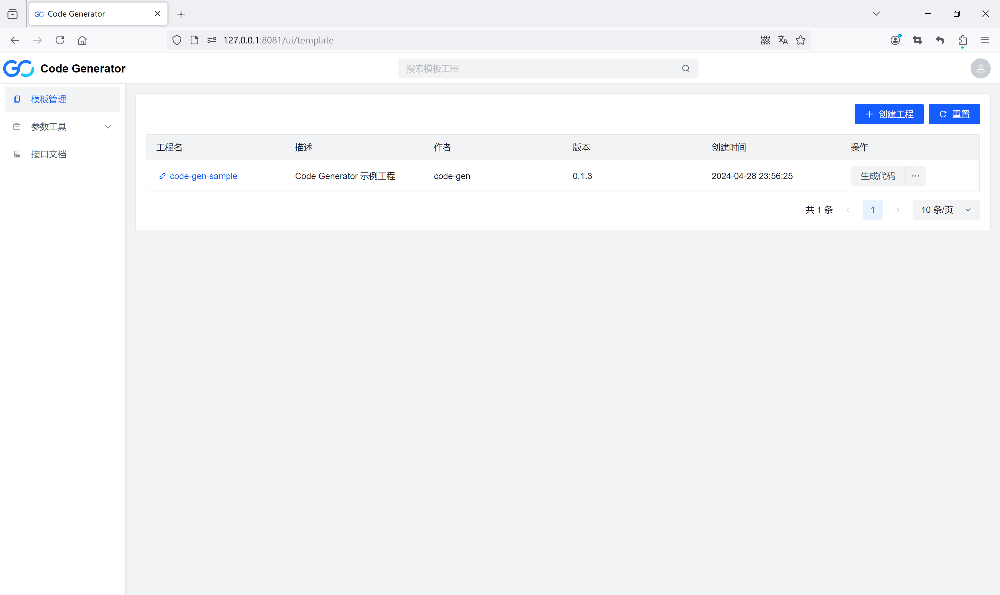
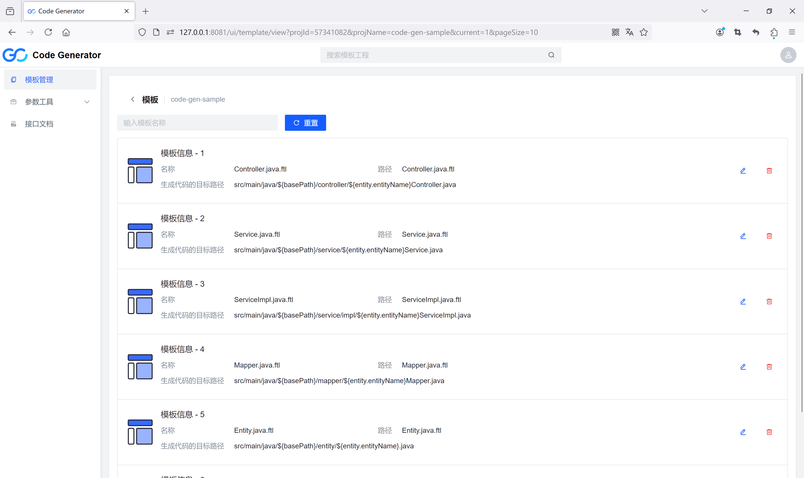
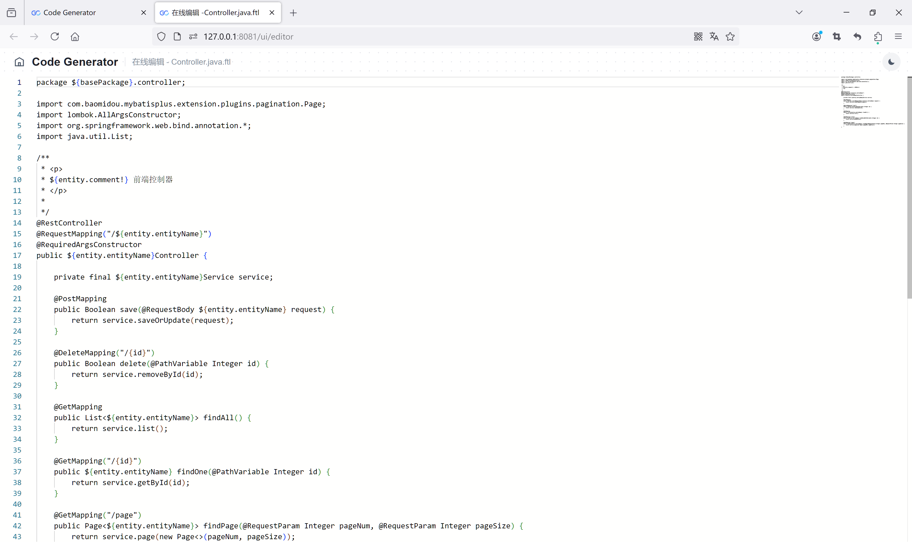
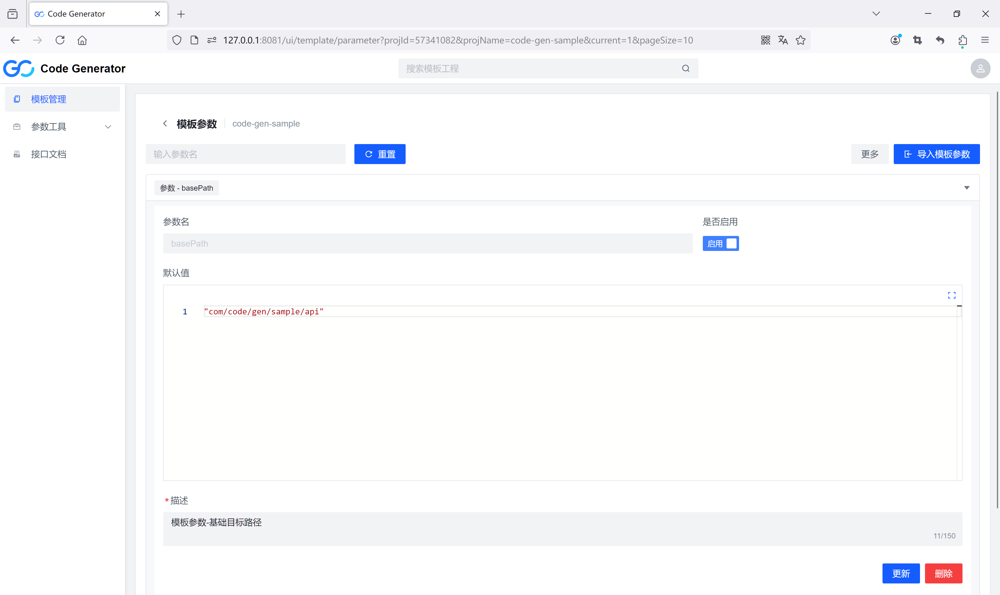
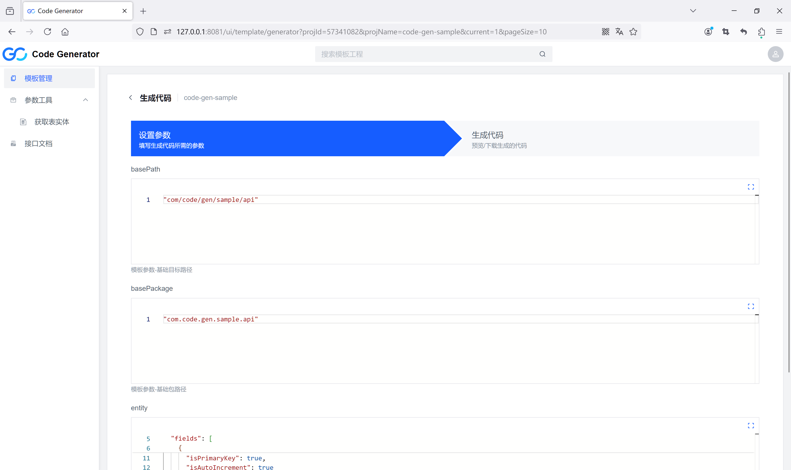
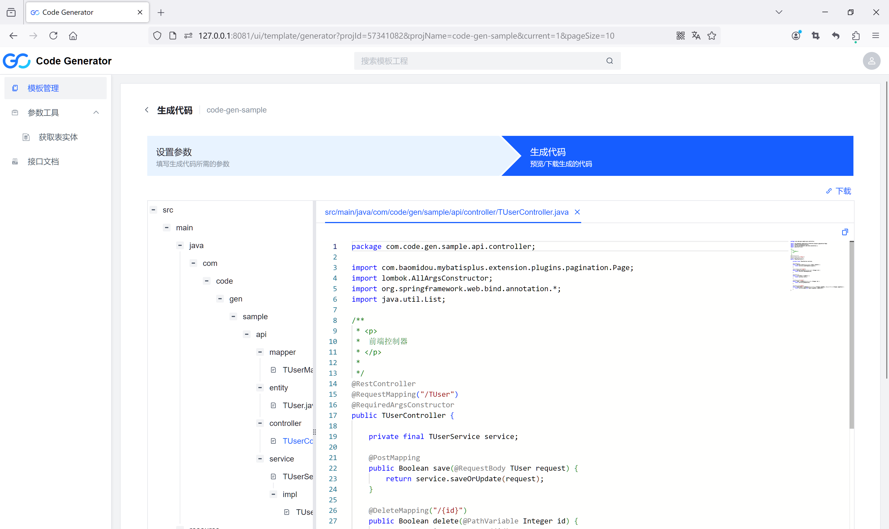
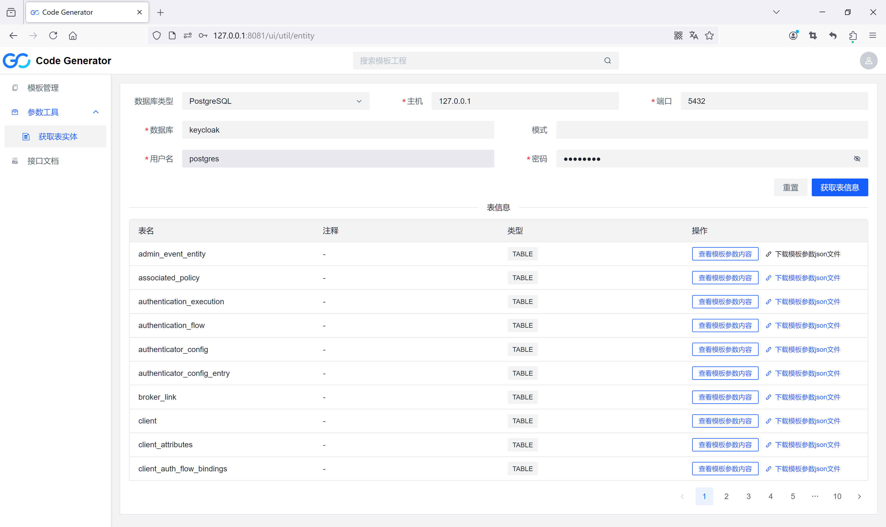

# Code Generator（代码生成器）

基于模板引擎（[**FreeMarker**](http://freemarker.foofun.cn/)）自定义模板文件和参数完成模板填充，使用 GitLab 作为存储服务。

### 主要技术

- Java 17
- Gradle
- SpringBoot 3
- Spring Security
- Open Feign
- Caffeine
- Monaco Editor

### 功能概述

- 模板管理

  创建模板工程，自定义 ftl 模板文件和模板参数，设置模板参数，由 FreeMarker 完成模板渲染，实现生成代码。

  - 基于Open Feign 实现对 GitLab 相关 API 的操作
  - 模板工程、模板参数的增删改查
    - 支持上传本地模板文件或创建空白模板（ftl 格式）
    - 支持导入模板参数文件（json 格式），基于 json-schema-validator 完成参数校验，批量添加或更新模板参数
      - 参数值以 json 数据存储，支持：object、string、array、number、boolean、null
    - 支持模板文件自定义生成代码的路径，路径支持参数填充
    - 支持模板文件的在线编辑
  - 生成代码
    - 支持预览或下载代码
    - 支持预览代码的树形结构展示
  - 基于 Caffeine 实现响应结果的缓存，避免重复的 GitLab 请求
  - 基于 Spring Security OAuth2 Client 集成 [**Auth Server**](https://github.com/opensrcdevelop/auth)，实现用户认证和权限控制

- 模板参数工具
  - 基于 JDBC 数据库连接的元信息，获取数据库及表的信息，转换为代码生成器支持的模板参数

### 持续集成

基于 [**GitHub Actions**](https://docs.github.com/zh/actions) 实现持续集成（CI），自动编译、打包、构建 Docker 镜像、发布到镜像仓库。

### 演示截图

登录

模板工程列表

模板列表

模板文件在线编辑

模板参数

设置模板参数

预览生成的代码

获取数据库表对应的实体模板参数

